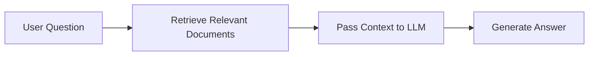

# 🤖 AI Engineering Journey

Welcome to the AI Engineering Journey repository — a beginner-friendly learning path that introduces the core ideas behind Artificial Intelligence, Machine Learning, Deep Learning, Generative AI, LLMs, RAG systems, and AI agents.

This repository is designed to help you move from basic concepts to practical implementation using real examples.

---

## 🌍 What is AI?

Artificial Intelligence (AI) is the field of building systems that can perform tasks that normally require human intelligence, such as:

- understanding language
- recognizing images
- making predictions
- learning from data
- generating content
- making decisions

### Types of AI

- Weak AI / Narrow AI: Built for a specific task, such as spam detection or chatbot responses.
- Strong AI: A hypothetical form of AI that could perform any intellectual task a human can do.

---

## 🧠 AI vs ML vs Deep Learning vs GenAI

```text
AI
├── Machine Learning
│   └── Deep Learning
└── Generative AI
```

- AI is the broad field.
- Machine Learning (ML) is a subset where systems learn patterns from data.
- Deep Learning uses neural networks with many layers to solve complex problems.
- Generative AI creates new content such as text, code, images, and audio.

---

## 📚 Core Data Concepts

### Structured vs Unstructured Data

- Structured data: Organized in rows and columns, such as CSV or SQL tables.
- Unstructured data: Free-form data such as text, documents, audio, images, and video.

### Labeled vs Unlabeled Data

- Labeled data: Includes the correct answer or category.
- Unlabeled data: Does not have predefined labels.

### Metadata

Metadata is information about data. For example, a document may have metadata such as title, author, and date.

---

## 🧪 Machine Learning Foundations

Machine Learning enables a model to learn patterns from data instead of being explicitly programmed for every rule.

### Common ML Types

- Supervised Learning: Learn from input-output examples.
- Unsupervised Learning: Discover hidden patterns from unlabeled data.
- Reinforcement Learning: Learn through trial and error using rewards and penalties.

### Important ML Concepts

- Training data: Used to teach the model.
- Features: Input variables that the model learns from.
- Model: The trained program used to make predictions.
- Training: The process of teaching the model.
- Inference: Using the trained model on new data.
- Evaluation: Measuring whether the model performs well.

### Example

A spam filter is a supervised learning problem:

- Input: email text
- Output: spam or not spam
- Training data: many emails with labels

---

## 🧠 Deep Learning Foundations

Deep Learning uses neural networks with many layers to solve more complex tasks.

### Neural Networks

A neural network is inspired by the human brain and learns patterns by adjusting weights through data.

### Popular Architectures

- CNNs (Convolutional Neural Networks): Best for images and computer vision.
- RNNs / LSTMs: Used for sequences like speech or time series.
- Transformers: Powerful architecture used in modern LLMs.

### Example

Image classification is a classic CNN use case.

---

## 👁️ Specialized AI Domains

### Natural Language Processing (NLP)

NLP helps machines understand and generate human language.

Examples:

- sentiment analysis
- chatbot responses
- translation
- summarization

### Computer Vision

Computer Vision teaches machines to understand visual content.

Examples:

- face recognition
- object detection
- medical image analysis

### Speech AI

Speech AI enables systems to work with voice input and output.

Examples:

- speech-to-text
- voice assistants
- text-to-speech

---

## 🔄 AI System Lifecycle


A real AI project usually follows this lifecycle:

1. Define the problem
2. Collect and prepare data
3. Build and train the model
4. Evaluate performance
5. Deploy the solution
6. Monitor and improve it

---

## 🧱 Generative AI and LLMs

Generative AI creates new content rather than simply classifying or predicting.

Examples:

- writing emails
- generating code
- creating images
- summarizing documents
- answering questions

### Key LLM Concepts

- Tokenization: Breaking text into pieces called tokens.
- Embeddings: Turning words or pieces of text into numerical vectors.
- Attention: Helping the model focus on important parts of input.
- Transformer: A modern neural network architecture used by most LLMs.

### Example Prompt

```text
Prompt: "Summarize this article in 3 bullet points."
```

A well-designed prompt often gives better results.

---

## ✍️ Prompt Engineering

Prompt engineering is the art of designing effective instructions for AI systems.

### Good Prompt Example

```text
You are a helpful AI tutor.
Explain the difference between supervised learning and reinforcement learning in simple terms.
```

### Why it matters

- improves relevance
- reduces ambiguity
- guides the model toward better output

---

## ⚠️ Common LLM Challenges

### Hallucination

A model may generate confident but incorrect information.

### Bias

Models can reflect bias present in training data.

### Latency and Cost

Larger models may be slower and more expensive.

### Quality Control

AI systems need evaluation, testing, and monitoring.

---

## 🔎 Retrieval-Augmented Generation (RAG)

RAG combines retrieval of relevant information with generation by an LLM.

### Why RAG is useful

Instead of relying only on the model’s memory, RAG allows the model to look up external documents first.

### RAG Flow



### Key Components

- Document loader
- Text chunking
- Embeddings
- Vector database
- Retriever
- LLM

### Example Use Case

A chatbot that answers questions from company documents, PDFs, or manuals.

---

## 🗂️ Vector Databases and Embeddings

A vector database stores embeddings so that relevant items can be found using similarity search.

### Why this matters

It allows systems to search by meaning, not just exact keyword match.

### Example

If a user asks: "What is the refund policy?"

The system can retrieve documents that are semantically related, even if they do not contain the exact phrase.

---

## 🤖 Agentic AI and MCP

Agentic AI refers to systems that can plan, use tools, and complete multi-step tasks with some level of autonomy.

### Model Context Protocol (MCP)

MCP is a way to give AI models structured access to tools, external systems, and data sources.

This is especially useful for:

- tool calling
- workflow automation
- multi-step reasoning
- connecting LLMs to real-world systems

---

## 🛠️ AI Engineering Workflow

An AI engineer usually works across several layers:

1. Problem definition
2. Data collection and cleaning
3. Model selection
4. Training and evaluation
5. Deployment
6. Monitoring and improvement

### Important Practices

- version control
- testing
- experiment tracking
- monitoring
- reproducibility
- responsible AI

---

## 📦 This Repository’s Learning Path

This repository contains several hands-on examples for different AI topics:

- gemini-gen-ai: generative AI experiments
- genai-playground: LLM usage with Ollama, Gemini, OpenAI providers
- rag-playground: a hands-on playground for RAG concepts

---

## 🚀 Beginner Roadmap

A practical learning path could look like this:

1. Learn Python basics
2. Understand data, ML, and neural networks
3. Learn how LLMs work
4. Practice prompt engineering
5. Build a simple RAG application
6. Explore agents and tool use
7. Learn deployment and monitoring

---

## 💡 Simple Example in Python

```python
from transformers import pipeline

classifier = pipeline("sentiment-analysis")
result = classifier("I love learning about AI!")
print(result)
```

This is a simple example of using a pretrained model for text classification.

---

## ✅ Best Practices for Learning AI

- start small
- build projects step by step
- learn by experimenting
- read documentation carefully
- keep track of your experiments
- understand the limitations of AI

---

## 🧭 Final Thoughts

AI is not just about using large models — it is about solving real problems with data, models, tools, and careful engineering.

The journey becomes easier when you:

- understand the basics clearly
- practice with small projects
- connect concepts to real-world use cases

---

## 📖 Glossary

- AI: Artificial Intelligence
- ML: Machine Learning
- DL: Deep Learning
- NLP: Natural Language Processing
- LLM: Large Language Model
- RAG: Retrieval-Augmented Generation
- Embedding: Numerical representation of data
- Vector Database: Database for similarity search over embeddings

---
